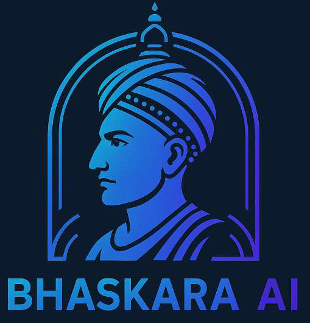

<div align="center">



# BHASKARA AI

### Offline · Multimodal · Privacy-First AI Assistant

[](https://python.org)
[](https://doc.qt.io/qtforpython/)
[](https://mistral.ai)
[](https://huggingface.co/runwayml/stable-diffusion-v1-5)
[](LICENSE)
[]()

> *Named in tribute to the legendary Indian mathematician **Bhāskara II**, this assistant brings powerful, private AI to your desktop — no cloud, no compromise.*

---

**[📋 Project Report](#-project-report) · [🚀 Features](#-features) · [🧠 Models](#-models) · [🛠 Installation](#-installation) · [🎮 Usage](#-usage) · [🏗 Architecture](#-architecture) · [📊 Performance](#-performance) · [🛣 Roadmap](#-roadmap)**

</div>

---

## 📖 Overview

**Bhaskara AI** is a fully offline, multimodal AI desktop assistant built with **PySide6** and powered by open-source models. It integrates natural language understanding, speech processing, computer vision, and image synthesis into a single cohesive application — running entirely on your local machine with zero external server dependency.

Unlike cloud-based AI assistants, Bhaskara AI keeps all your data — conversations, voice inputs, and images — strictly on-device, making it ideal for privacy-sensitive environments, offline/remote scenarios, educational use, and accessibility-focused workflows.

```
┌────────────────────────────────────────────────────────────────┐
│                       BHASKARA AI                              │
│                                                                │
│   Text Chat  ──►  Mistral-7B (llama-cpp)  ──►  Response        │
│   Voice In   ──►  SpeechRecognition       ──►  TTS Out         │
│   Image In   ──►  Tesseract / Faster-RCNN ──►  OCR / Tags      │
│   Text       ──►  Stable Diffusion v1.5   ──►  Image Out       │
│                                                                │
│              All processing happens locally.                   │
└────────────────────────────────────────────────────────────────┘
```

---

## ✨ Features

### 🤖 Conversational AI
- **LLM-powered chat** via **Mistral-7B-Instruct-v0.2** (GGUF Q4_K_M quantized)
- Context-aware, instruction-following responses powered by `llama-cpp-python`
- Supports general knowledge, tutoring, creative writing, coding help, and more
- Fully offline — no API key, no internet required

### 🎙 Voice Interaction
- **Real-time speech-to-text** using Python `SpeechRecognition` library
- **Text-to-speech (TTS)** responses via `pyttsx3` with female voice selection
- **Voice-to-voice** full conversation loop — speak and hear replies
- **Text-to-voice** mode: type a message, receive an audio response
- Animated hexagonal loader with live transcription feedback during voice capture
- In-app audio playback via `QMediaPlayer`; save or discard voice response files
- Optional radio-style voice effect applied via `pydub` post-processing

### 🖼 Image Intelligence
- **OCR (Optical Character Recognition)** via Tesseract / PyTesseract
  - Extract text from uploaded images, photos of documents, whiteboards, or handwritten notes
  - OpenCV preprocessing (bilateral filtering, adaptive thresholding, sharpening) for accuracy
- **Object Detection** via PyTorch Faster R-CNN
  - Identify and label objects in any image with bounding boxes
- **Camera capture** support for real-time webcam image input
- Upload via file dialog or camera — both paths fully supported

### 🎨 AI Image Generation
- **Text-to-image generation** using **Stable Diffusion v1.5** (GGUF Q8_0 quantized)
- Runs locally via `stable-diffusion-cpp` — no internet, no API
- Generates 512×512 images from any natural language prompt
- Images displayed inline in the chat with a download option
- Negative prompt support to refine output quality

### 🌤 News & Weather
- **Real-time weather** for multiple cities (Dehradun, Delhi, Mumbai, Bengaluru, Kolkata) via `wttr.in` and WeatherAPI
- **Live news feed** via NewsData.io API, displayed as styled cards with clickable article links
- Both are fetched asynchronously via `QThread` to keep the UI non-blocking

### 💬 Multi-Chat Management
- Create, name, rename, resume, and delete multiple independent chat sessions
- Each chat persists with full message history, timestamps, and UUID-based IDs
- Sidebar displays all past chats sorted by last-updated timestamp
- Chat history stored locally in `saved_chats.json`
- Context menu on sidebar items: rename or delete any conversation

### 🔐 User Authentication
- Local login/signup system using **SQLite**
- Password stored securely in a local database
- Session persistence via `user_login_status.json`
- Auto-login on next launch if session is active

### 🖥 Interface & UX
- Dark-themed PySide6 GUI with custom CSS stylesheets
- Custom `ChatBubble` widgets (blue for user, gray for bot) with right-click copy support
- Animated sidebar toggle (expand/collapse with `QPropertyAnimation`)
- Custom `CustomSplashScreen` with fade-in animation on startup
- Styled `WeatherCard` and `NewsCard` widgets in a horizontal scrollable layout
- Code editor launch integration — AI-generated code opens directly in Notepad or VS Code
- Responsive minimum window size of 1000×600px

---

## 🧠 Models

### Mistral-7B-Instruct-v0.2 · Language Model

| Property | Value |
|---|---|
| Parameters | 7 Billion |
| Quantization | Q4_K_M (GGUF) |
| Memory Usage | ~3.1 GB VRAM |
| Context Window | 1000 tokens (configurable) |
| Inference Backend | `llama-cpp-python` |
| Architecture | Transformer with Grouped-Query Attention (GQA) + Sliding Window Attention (SWA) |
| Fine-tuning | RLHF instruction-following |

**How it works in Bhaskara AI:**
1. User text (or speech-to-text output) is formatted with a `format_prompt()` wrapper
2. Tokens are generated using local `llama-cpp-python` inference at temperature 0.6
3. Output tokens are decoded back to human-readable text and displayed in the chat
4. Inference runs in a `ChatModelThread` (QThread) to keep the UI responsive

> 📂 Model path: `models/mistral-7b-instruct-v0.2-q4_k_m.gguf`

---

### Stable Diffusion v1.5 · Image Generation Model

| Property | Value |
|---|---|
| Quantization | Q8_0 (GGUF) |
| Memory Usage | ~4.5 GB VRAM |
| Output Resolution | 512×512 px |
| Inference Backend | `stable-diffusion-cpp` |
| Architecture | Latent Diffusion Model (UNet + CLIP ViT-L/14 text encoder + VAE) |
| Inference Steps | 50–100 denoising steps |

**How it works in Bhaskara AI:**
1. User enters a text prompt (e.g., *"a futuristic city at sunset"*)
2. CLIP encodes the prompt into numerical embeddings
3. A denoising loop (UNet + scheduler) refines a 64×64 latent over ~50 steps
4. VAE decoder upscales the latent to a full 512×512 PNG image
5. Image is saved to `generated_images/` and displayed inline in the chat

> 📂 Model path: `models/stable-diffusion-v1-5-pruned-emaonly-Q8_0.gguf`

---

## 🛠 Installation

### Prerequisites

| Requirement | Version |
|---|---|
| Python | 3.10+ |
| Tesseract OCR | 5.x |
| CUDA (optional) | 11.x+ for GPU acceleration |
| RAM | 8 GB minimum (16 GB recommended) |
| Storage | ~12 GB for both models |

### 1. Clone the Repository

```bash
git clone https://github.com/NitinThapa30/Bhaskara-AI.git
cd Bhaskara-AI
```

### 2. Install Python Dependencies

```bash
pip install -r requirements.txt
```

<details>
<summary>📦 Full dependency list</summary>

```
PySide6
llama-cpp-python
stable-diffusion-cpp
speechrecognition
pyttsx3
pytesseract
opencv-python
torch
torchvision
Pillow
requests
pydub
numpy
```

</details>

### 3. Install Tesseract OCR

**Windows:**
```
Download from: https://github.com/UB-Mannheim/tesseract/wiki
Install to: C:\Program Files\Tesseract-OCR\tesseract.exe
```

**Linux:**
```bash
sudo apt install tesseract-ocr
```

**macOS:**
```bash
brew install tesseract
```

### 4. Download Models

Place the following models in the `models/` directory:

```
models/
├── mistral-7b-instruct-v0.2-q4_k_m.gguf     (~4.1 GB)
└── stable-diffusion-v1-5-pruned-emaonly-Q8_0.gguf  (~2.1 GB)
```

| Model | Download Link |
|---|---|
| Mistral-7B-Instruct Q4_K_M | [TheBloke on HuggingFace](https://huggingface.co/TheBloke/Mistral-7B-Instruct-v0.2-GGUF) |
| Stable Diffusion v1.5 Q8_0 | [HuggingFace](https://huggingface.co/runwayml/stable-diffusion-v1-5) |

### 5. Configure API Keys (Optional)

Create a `config.yaml` file in the root directory:

```yaml
newsdata_api_key: "YOUR_NEWSDATA_API_KEY"   # https://newsdata.io
weather_api_key: "YOUR_WEATHERAPI_KEY"       # https://www.weatherapi.com
```

> ⚠️ Weather falls back to `wttr.in` (no key needed) if WeatherAPI key is not set.

### 6. Run the Application

```bash
python main_gui.py
```

---

## 🎮 Usage

### Starting Up
1. Launch the app — a custom animated splash screen appears
2. **Sign up** or **log in** with your local credentials
3. The main dashboard loads with the chat area, sidebar history, weather cards, and news feed

### Interaction Modes

| Button | Mode | Description |
|---|---|---|
| ⌨️ Input bar + Enter | **Text Chat** | Type a message and press Enter to chat with Mistral-7B |
| 🎙 Voice Chat | **Voice-to-Voice** | Speak → Mistral generates response → TTS plays it back |
| 🔊 Speak Text | **Text-to-Voice** | Type text → converted to audio and played in-app |
| 🖼 Image to Text | **OCR / Object Detection** | Upload or capture image → extract text or detect objects |
| 🎨 Generate Image | **Text-to-Image** | Describe an image → Stable Diffusion generates it |

### Chat Management

```
Sidebar ──► + New Chat         Create a new conversation session
            [Chat History]     Click any past chat to resume it
            Right-click        Rename or Delete a conversation
```

### Voice Interaction Flow

```
Click "Voice Chat"
        │
        ▼
[Animated Hexagonal Loader appears — "Listening..."]
        │
        ▼
[Speak your message]
        │
        ▼
[Transcription shown in real-time]
        │
        ▼
[Mistral-7B processes your query]
        │
        ▼
[pyttsx3 synthesizes response audio]
        │
        ▼
[Audio plays in-app via QMediaPlayer]
```

### Image Generation Example

```
You: Generate an image of a futuristic city at sunset

Bot: Generating image...
     [Image displayed inline in chat]
     📁 Image generated and saved at: generated_images/image_20250501_142310.png
     [Open File] button appears
```

---

## 🏗 Architecture

### System Overview

```
┌─────────────────────────────────────────────────────────────────────┐
│                            FRONTEND (main_gui.py)                   │
│                                                                     │
│  ┌──────────────┐   ┌──────────────────┐   ┌───────────────────┐    │
│  │   Sidebar    │   │   Chat Display   │   │   Input Bar       │    │
│  │  (QFrame)    │   │  (QListWidget)   │   │  (QTextEdit +     │    │
│  │              │   │                  │   │   Mode Buttons)   │    │
│  │ Chat History │   │  ChatBubble[]    │   │                   │    │
│  │ WeatherCards │   │  WeatherCard[]   │   │  Voice / Image /  │    │
│  │ NewsCards    │   │  NewsCard[]      │   │  Text / Generate  │    │
│  └──────────────┘   └──────────────────┘   └───────────────────┘    │
│                                                                     │
│         Signal/Slot ──────────────────────────────────────          │
│                                                                     │
│  ┌────────────────────────────────────────────────────────────┐     │
│  │                    QThread Workers                         │     │
│  │  ChatModelThread  │ VoiceChatThread  │ ImageProcessThread  │     │
│  │  ImageGenThread   │ WeatherThread    │ NewsFetchThread     │     │
│  └────────────────────────────────────────────────────────────┘     │
└─────────────────────────────────────────────────────────────────────┘
                              │
                              ▼
┌─────────────────────────────────────────────────────────────────────┐
│                           BACKEND (backend.py)                      │
│                                                                     │
│   chat_with_model()    ──►  Mistral-7B via llama-cpp-python         │
│   speak()              ──►  pyttsx3 + pydub + QMediaPlayer          │
│   listen()             ──►  SpeechRecognition (Google STT)          │
│   text_to_image()      ──►  Stable Diffusion via stable-diff-cpp    │
│   preprocess_and_ocr() ──►  OpenCV + PyTesseract                    │
│   get_weather()        ──►  wttr.in / WeatherAPI (HTTP GET)         │
│   get_news()           ──►  NewsData.io (HTTP GET)                  │
│   launch_editor()      ──►  Notepad / VS Code via subprocess        │
└─────────────────────────────────────────────────────────────────────┘
                              │
                              ▼
┌─────────────────────────────────────────────────────────────────────┐
│                         DATA LAYER                                  │
│                                                                     │
│   saved_chats.json      ──  Chat history (UUID-keyed, timestamped)  │
│   users.db (SQLite)     ──  User accounts (login/signup)            │
│   user_login_status.json──  Active session persistence              │
│   voice_responses/      ──  TTS audio files (.wav)                  │
│   generated_images/     ──  Stable Diffusion outputs (.png)         │
└─────────────────────────────────────────────────────────────────────┘
```

### Entity-Relationship Diagram

```
User ────has────► ChatSession ────contains────► Message
  │                                                │
  │                                         ┌──────┴──────┐
  │                                      AudioFile    ImageInput
  │                                         │              │
  └────────────►  UsageLog ◄────────────────┴──────────────┘
                     │
                  AIModel
```

### Project File Structure

```
Bhaskara-AI/
│
├── main_gui.py              # PySide6 frontend — MainWindow, widgets, threads
├── backend.py               # Core AI logic — LLM, TTS, STT, OCR, image gen
├── chat_manager.py          # Chat CRUD operations (create/save/load/delete)
├── login_signup.py          # SQLite-backed user auth (login/signup/logout)
├── utils/
│   └── session_manager.py   # Session persistence helpers
│
├── models/
│   ├── mistral-7b-instruct-v0.2-q4_k_m.gguf
│   └── stable-diffusion-v1-5-pruned-emaonly-Q8_0.gguf
│
├── assets/
│   └── Bhaskara AI.png      # Application logo
│
├── generated_images/        # Auto-created — Stable Diffusion outputs
├── voice_responses/         # Auto-created — TTS .wav files
├── chats/                   # Auto-created — per-chat JSON files
│
├── saved_chats.json         # Master chat history index
├── users.db                 # SQLite user database
├── user_login_status.json   # Active session token
│
├── config.yaml              # API keys and model paths (optional)
├── requirements.txt
└── README.md
```

---

## 📊 Performance

### Inference Times

| Task | Hardware | Time |
|---|---|---|
| Text generation (100 tokens) | 4-core CPU, 16 GB RAM | ~2.5 seconds |
| Text generation (100 tokens) | 8 GB GPU | < 1 second |
| Image generation (512×512) | CPU | ~15 seconds |
| Image generation (512×512) | GPU | ~8–10 seconds |
| Voice transcription | Network dependent | 3–5 seconds |
| OCR (standard image) | CPU | ~1–2 seconds |
| Weather / News API call | Network dependent | ~1.2 seconds |

### Resource Usage

| Component | RAM / VRAM |
|---|---|
| Mistral-7B Q4_K_M | ~3.1 GB VRAM |
| Stable Diffusion Q8_0 | ~4.5 GB VRAM |
| PySide6 GUI | ~500 MB RAM |
| Tesseract + OpenCV | ~200 MB RAM |

### Comparison with Commercial Alternatives

| Feature | Bhaskara AI | Google Assistant | ChatGPT | Siri |
|---|---|---|---|---|
| ✅ Offline Support | ✅ Full | ❌ | ❌ | ❌ |
| ✅ Open-Source Models | ✅ | ❌ | ❌ | ❌ |
| ✅ Privacy by Design | ✅ | ❌ | ❌ | ❌ |
| 🖼 Image Generation | ✅ | ❌ | ✅ (paid) | ❌ |
| 🎙 Voice Interaction | ✅ | ✅ | ⚠️ limited | ✅ |
| 💬 Multi-modal Input | ✅ | ⚠️ limited | ✅ | ⚠️ |
| 🔒 Data Stays Local | ✅ | ❌ | ❌ | ❌ |

---

## 🔒 Privacy & Security

Bhaskara AI is built on an **offline-first, privacy-by-design** philosophy:

- 🔐 **All data is processed locally** — no telemetry, no cloud uploads
- 🗄 **Chat history** stored only in local JSON files
- 🔑 **Passwords** stored in local SQLite (plain text in current version — bcrypt upgrade planned)
- 🎙 **Voice inputs** are transcribed via Google STT (network call); Vosk offline STT planned as replacement
- 🖼 **Uploaded images** are processed in-memory; temp files auto-deleted after use
- 📵 **No analytics, no ads, no external tracking of any kind**

---

## 🛣 Roadmap

### v2.0 — Planned
- [ ] **Offline STT** — Replace Google Speech API with Vosk or Whisper for fully offline voice
- [ ] **Better TTS** — Integrate Piper or Coqui TTS for natural, expressive voice output
- [ ] **Wake word** — "Hey Bhaskara" always-on detection
- [ ] **Multilingual support** — Hindi, Tamil, Bengali, and other Indian languages
- [ ] **LoRA fine-tuning** — Domain-specific model adaptation (education, coding, etc.)

### v2.5 — Future
- [ ] **RAG (Retrieval-Augmented Generation)** — Ask questions over local PDFs and documents using FAISS / ChromaDB
- [ ] **Plugin architecture** — Install custom extensions (calculator, translator, code runner)
- [ ] **Desktop automation** — Integrate `pyautogui` for hands-free task execution
- [ ] **Mobile companion** — Local-network web UI for smartphone access
- [ ] **GPU acceleration** — CUDA backend for faster LLM and Stable Diffusion inference
- [ ] **Password hashing** — Replace plain-text passwords with bcrypt/Argon2

---

## 📋 Project Report

This project was developed as a **Major Project** for the Diploma in Computer Science & Engineering at **G.R.D Polytechnic, Dehradun** (Affiliated with UBTER Roorkee), 2022–2025.

- **Authors:** Nitin Thapa (22082050015), Vansh Kumar (22082050028), Saurav Kumar (22082050023)
- **Guide:** Mr. Ravindra Kumar, Head of Department — CSE
- **Institution:** G.R.D Polytechnic, Rajpur Road, Dehradun — 248001

The full project report covers system architecture, module analysis, UI/UX design principles, data privacy considerations, model internals, source code, performance evaluation, and future scope.

> 📄 [View Full Project Report (PDF)](./Major_Project_Bhaskara_AI_Report.pdf)

---

## 🤝 Contributing

Contributions are welcome! To contribute:

1. Fork the repository
2. Create your feature branch: `git checkout -b feature/my-feature`
3. Commit your changes: `git commit -m "Add my feature"`
4. Push to the branch: `git push origin feature/my-feature`
5. Open a Pull Request

Please open an issue first if you're planning a large change, so we can discuss the approach.

---

## 📄 License

This project is released under the [MIT License](LICENSE).

---

## 🙏 Acknowledgements

- [Mistral AI](https://mistral.ai) — Mistral-7B-Instruct language model
- [Stability AI / RunwayML](https://huggingface.co/runwayml/stable-diffusion-v1-5) — Stable Diffusion v1.5
- [llama.cpp](https://github.com/ggerganov/llama.cpp) — Efficient local LLM inference
- [stable-diffusion.cpp](https://github.com/leejet/stable-diffusion.cpp) — Efficient local SD inference
- [Qt / PySide6](https://doc.qt.io/qtforpython/) — Cross-platform GUI framework
- [Tesseract OCR](https://github.com/tesseract-ocr/tesseract) — Open-source OCR engine
- [TheBloke on HuggingFace](https://huggingface.co/TheBloke) — GGUF quantized model distributions

---


<div align="center">

Made with ❤️ in Dehradun, India

**[⬆ Back to top](#bhaskara-ai)**

</div>
